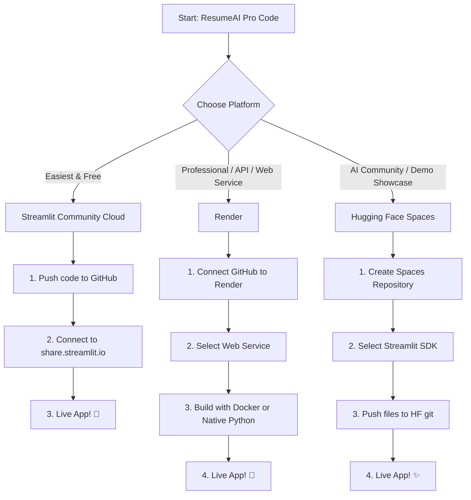

# 🚀 Deploying ResumeAI Pro

This guide walks you through deploying the **ResumeAI Pro (Resume Analyzer)** application to production. Since this is a lightweight, pure-Python Streamlit application, it can be deployed for **free** on multiple modern cloud platforms.

Choose one of the deployment pathways below:

---

## 🗺️ Deployment Pathways



---

## 🌟 Option 1: Streamlit Community Cloud (Recommended & 100% Free)

Streamlit Community Cloud is the official hosting platform built by the Streamlit team. It hooks directly into your GitHub repository and automatically deploys any changes you push.

### Step 1: Push your code to GitHub
Create a new GitHub repository and push your project files. Ensure you **exclude** your virtual environment (`.venv`) by utilizing the configured `.gitignore`.
```bash
git init
git add .
git commit -m "Initial commit for ResumeAI Pro"
git branch -M main
git remote add origin https://github.com/YOUR_USERNAME/YOUR_REPO_NAME.git
git push -u origin main
```

### Step 2: Sign up/Log in to Streamlit Share
1. Head over to [share.streamlit.io](https://share.streamlit.io).
2. Click **Connect with GitHub** and authorize Streamlit.

### Step 3: Deploy the App
1. Once logged in, click the **New app** button.
2. Select your repository: `YOUR_USERNAME/YOUR_REPO_NAME`.
3. Select your branch: `main`.
4. Enter the main file path: `app.py`.
5. Click **Deploy!** 🚀

Your app will be live on a custom URL (e.g., `https://your-app-name.streamlit.app`) in under 2 minutes.

---

## 💎 Option 2: Render (Free Tier or Professional Web Service)

[Render](https://render.com) is an excellent choice for a cloud web service. You can deploy it using the **Native Python environment** or via **Docker containerization** using the custom `Dockerfile` we created.

### Pathway A: Native Python (No Docker)
1. Sign up on [Render.com](https://render.com).
2. Click **New +** and select **Web Service**.
3. Connect your GitHub repository.
4. Set the following configurations:
   * **Language**: `Python 3`
   * **Region**: Choose the closest region to your users.
   * **Branch**: `main`
   * **Build Command**: `pip install -r requirements.txt`
   * **Start Command**: `streamlit run app.py --server.port 10000 --server.address 0.0.0.0`
5. Under **Advanced**, add an Environment Variable if you require any custom ports, though Render automatically maps port `10000` to HTTP traffic.
6. Click **Deploy Web Service**.

### Pathway B: Dockerized Container (Highly Reliable)
Using our container setup guarantees that the environment matches perfectly.
1. Connect your repository to Render as a **Web Service**.
2. Select **Docker** as the environment (Render will automatically detect the `Dockerfile` at the root of the project).
3. Under **Advanced**, Render will automatically bind to port `8501` as specified in our `Dockerfile`.
4. Click **Deploy Web Service**.

---

## 🎨 Option 3: Hugging Face Spaces (Great for Portfolios)

Hugging Face Spaces allows you to host ML apps for free. It is a fantastic showcase for machine learning projects.

### Step 1: Create a Space
1. Sign up on [Hugging Face](https://huggingface.co).
2. Go to **Spaces** and click **Create new Space**.
3. Name your space (e.g., `resume-ai-pro`).
4. Select **Streamlit** as the SDK.
5. Choose **Public** or **Private**.
6. Choose the **Free (CPU Basic)** hardware tier.

### Step 2: Push your code
Hugging Face provides a Git URL for your Space. Clone it locally and add your files, or upload them directly using their Web UI:
```bash
# Clone the empty space repository
git clone https://huggingface.co/spaces/YOUR_HF_USERNAME/YOUR_SPACE_NAME

# Copy all the project files into the cloned folder (excluding .venv)
cp -r /path/to/Resume_Analyzer/* YOUR_SPACE_NAME/

# Navigate to the cloned folder, commit, and push
cd YOUR_SPACE_NAME
git add .
git commit -m "Deploy ResumeAI Pro to HF Spaces"
git push
```

Hugging Face will automatically install everything listed in your `requirements.txt` and run `app.py` automatically.

---

## 🐳 Option 4: Local Docker Run (To Verify Containerization)

To make sure your container works perfectly before pushing to any cloud platform, you can run it locally with Docker:

### 1. Build the Docker Image
```bash
docker build -t resume-analyzer:latest .
```

### 2. Run the Docker Container
```bash
docker run -p 8501:8501 resume-analyzer:latest
```

Open your browser and navigate to `http://localhost:8501` to test the container.

---

## ⚡ Production & Optimization Tips

* **Model Optimization**: The classifier automatically compiles its hybrid training pipeline in-memory and caches the loaded models using Streamlit's `@st.cache_resource` system. This makes page reloads instantly fast and keeps memory overhead below `150MB`.
* **Dark Mode Syncing**: The `.streamlit/config.toml` contains preset base variables (`base = "dark"`, `#0B1120` deep dark blue backgrounds, etc.) matching modern UI standards. No manual theme configuration is needed in the cloud!
* **Upload Limits**: Streamlit allows file uploads up to `200MB` by default. You can tweak this in `.streamlit/config.toml` under the `[server]` config if needed:
  ```toml
  [server]
  maxUploadSize = 10
  ```
