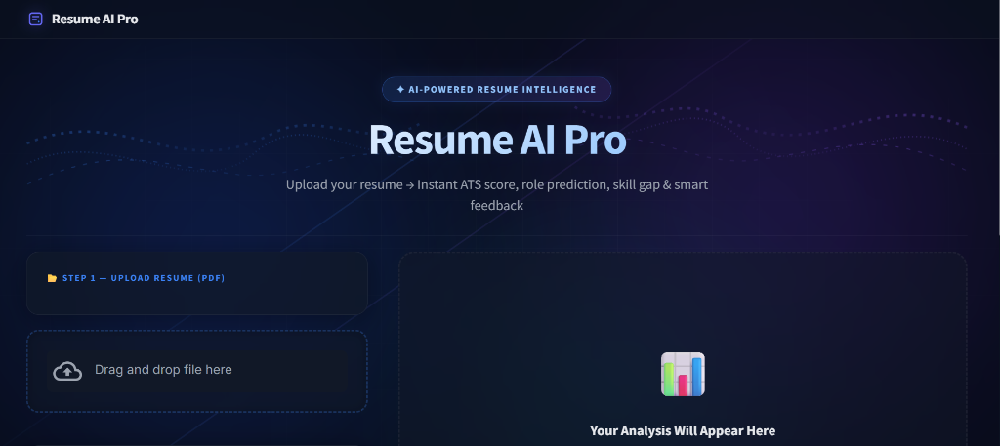
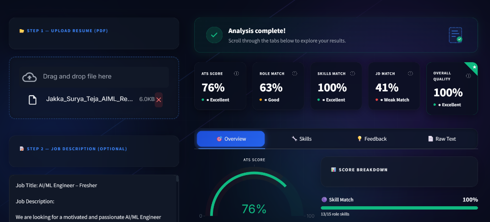
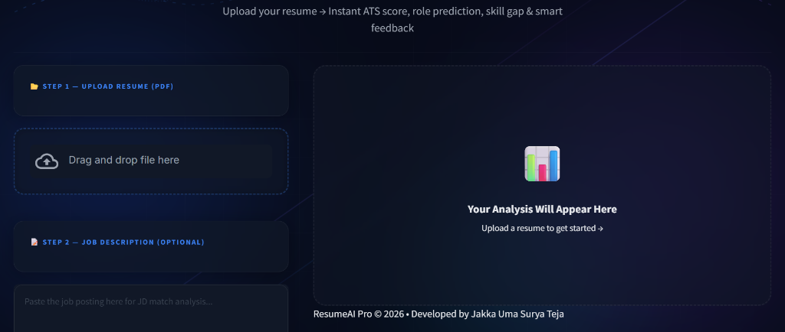
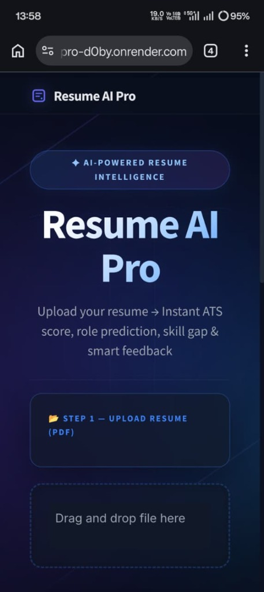
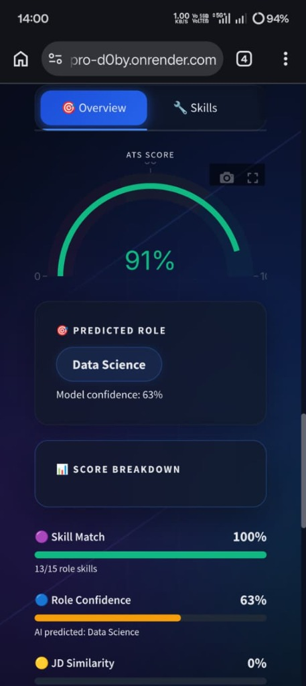
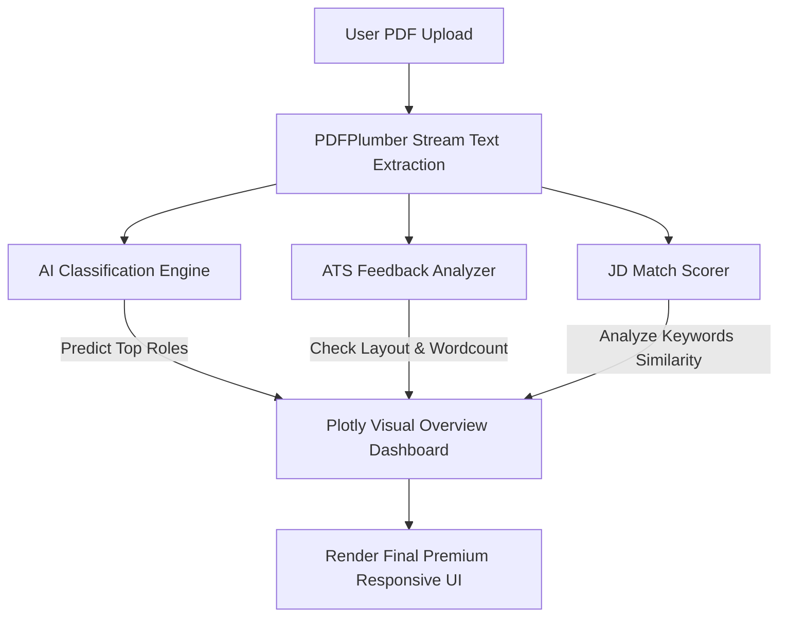

# 🚀 ResumeAI Pro — Premium AI SaaS Resume Intelligence

[](https://resume-ai-pro-d0by.onrender.com)
[](https://share.streamlit.io)
[](https://python.org)
[](LICENSE).

ResumeAI Pro is a production-level, premium AI-powered resume analysis platform designed for modern recruiters and job seekers. Inspired by design languages like Vercel, Linear, and Stripe, it delivers a glassmorphic, responsive, and blazing-fast analytics dashboard to analyze resumes, predict job roles, measure keyword similarity against job descriptions, and extract personalized improvement suggestions.

> **Live Demo:** [https://resume-ai-pro-d0by.onrender.com](https://resume-ai-pro-d0by.onrender.com).

---

## 📸 Product Mockups & Screenshots

### 🖥️ Desktop Experience
<p align="center">
  
</p>
<br>
<p align="center">
  
</p>
<br>
<p align="center">
  
</p>

### 📱 Mobile Experience
<p align="center">
  
  &nbsp;&nbsp;&nbsp;&nbsp;
  
</p>

---

## ✨ Features

- 🧠 **AI Role Prediction & Classification**: A custom machine learning classifier predicts candidate roles among several developer positions and shows confidence probabilities.
- 🎯 **ATS Scoring Engine**: Multi-dimensional scoring formula measuring keyword match, section completeness, formatting quality, and spelling grammar signals.
- 🟡 **Semantic Job Description Matching**: Allows candidates to paste a JD to compute semantic keyword matching, overlap ratios, and tag missing keywords.
- 🔧 **Advanced Skill Extraction**: Visualizes detected and missing tech stacks, frameworks, and programming languages as interactive color-coded tags.
- 💡 **Smart Actionable Recommendations**: Dynamically generates detailed action plans (quantifying accomplishments, using action verbs, adding missing sections, formatting tips).
- 🎨 **Futuristic Glassmorphism UI**: Beautiful deep navy backdrop, glowing aurora orbs, dynamic light streaks, interactive micro-animations, and animated mesh background waves.
- 📱 **Real-App Mobile UX**: Mobile horizontal swipe tabs, auto-stacking scorecard grids, fluid margins, and fluid typography for flawless styling on narrow portrait screens.

---

## 🛠️ Tech Stack

- **Frontend & App Framework**: [Streamlit](https://streamlit.io/) (highly optimized, styled with atomic CSS injected custom styles and responsive breakpoints)
- **Machine Learning Core**: [Scikit-Learn](https://scikit-learn.org/) (hybrid term frequency–inverse document frequency vectorizer & Multinomial Naive Bayes classification model)
- **Data Visualization**: [Plotly](https://plotly.com/) (fully responsive custom indicator gauge gauges and breakdown charts)
- **PDF Extraction**: [PDFPlumber](https://github.com/jasonmc/pdfplumber) (efficient in-memory binary text stream scanner)
- **Styling Core**: Vanilla CSS & Custom SVG vectors (glassmorphism tokens, moving mesh animations, text-glow shadows)
- **Deployment**: [Render Cloud Services](https://render.com/) (Web Service containerized with dynamic port bindings and Python 3.11.9 runtime)

---

## 📐 Architecture & Lifecycle Flow



To deliver a flawless user experience, the code uses a **Two-Stage rendering strategy**:
1. **Landing Stage**: Renders the file uploader and instructions card with the premium horizontal gradient footer, using `st.stop()` to pause computation safely before models run.
2. **Analysis Stage**: Triggers when a valid PDF is detected and analyzed, appending the footer at the very end of the completed tabs panels.

---

## 🚀 Installation & Local Setup

Prerequisites: **Python 3.11.x** installed.

### 1. Clone the repository
```bash
git clone https://github.com/umasuryateja/Resume_AI_Pro.git
cd Resume_AI_Pro
```

### 2. Create and activate a Virtual Environment
```bash
python -m venv .venv
# On Windows:
.venv\Scripts\activate
# On macOS/Linux:
source .venv/bin/activate
```

### 3. Install dependencies
```bash
pip install -r requirements.txt
```

### 4. Run the application
```bash
streamlit run app.py
```

The application will launch automatically at `http://localhost:8501`.

---

## 💎 Production Deployment on Render

This project is configured with a fully optimized, lightweight deployment scheme suited for Render's **Free Tier Web Service**:

1. **Memory Pruning**: Redundant deep-learning and heavy NLP libraries have been removed from `requirements.txt` to keep the build image light and prevent compilation memory leaks.
2. **Dynamic Binding**: Hardcoded Streamlit ports are removed to allow Render's load balancer to dynamically bind custom environment `$PORT` values.
3. **Environment Setup**: Pinned `PYTHON_VERSION = 3.11.9` in `render.yaml`.

Deploy automatically by connecting this repository to a Render Web Service.

---

## 📝 Developer Credits

Developed with ❤️ by **Jakka Uma Surya Teja**

- **Copyright**: ResumeAI Pro © 2026
- **Portfolio / Demo**: [https://resume-ai-pro-d0by.onrender.com](https://resume-ai-pro-d0by.onrender.com)
